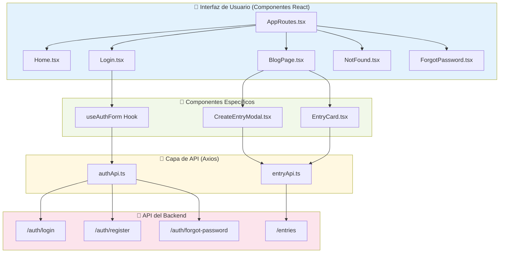
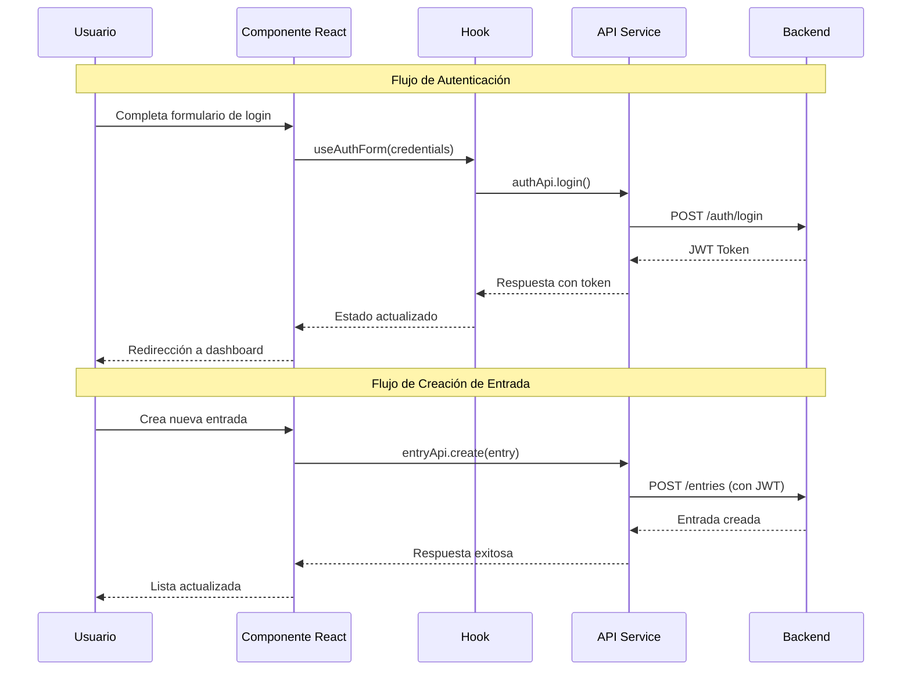
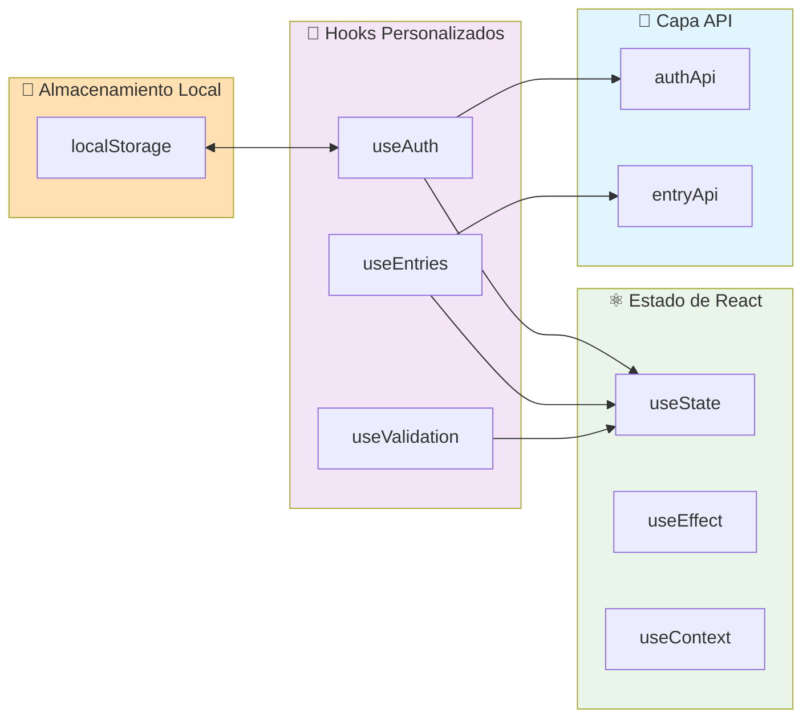

# EmotionalBlog - Frontend

Este es el repositorio para el frontend de la aplicación EmotionalBlog, una plataforma para escribir y gestionar entradas de blog basadas en emociones. La aplicación está construida con React, Vite y TypeScript.

## Visión General de la Arquitectura

El frontend sigue una **arquitectura modular basada en funcionalidades (feature-based)**. El código fuente está organizado en directorios que representan una funcionalidad específica de la aplicación (como `blog`, `forms`, `Home`). Esto facilita la escalabilidad y el mantenimiento.

- **Framework**: React 19 con Vite
- **Lenguaje**: TypeScript
- **Enrutamiento**: `react-router-dom` para la navegación del lado del cliente
- **Comunicación API**: `axios` para realizar peticiones HTTP a un backend REST. La autenticación se gestiona mediante tokens JWT que se almacenan en `localStorage`
- **Estilos**: CSS modularizado por componente/funcionalidad

### Diagrama de Arquitectura del Frontend

Este diagrama muestra el flujo de datos y la relación entre los componentes principales de la aplicación.



### Flujo de Datos de la Aplicación



## Estructura de Carpetas (`src`)

La carpeta `src` está organizada por funcionalidades para mantener el código separado y cohesivo.

```
src/
├── 🎨 assets/                  # Archivos estáticos
│   ├── images/                # Imágenes y logos
│   └── videos/                # Videos y animaciones
├── 📝 blog/                   # Funcionalidad del Blog
│   ├── api/                   # Llamadas a la API (entryApi.ts)
│   ├── components/            # Componentes específicos del blog
│   │   ├── CreateEntryModal.tsx
│   │   ├── EntryCard.tsx
│   │   └── EntryList.tsx
│   ├── hooks/                 # Hooks personalizados
│   │   ├── useEntries.ts
│   │   └── useCreateEntry.ts
│   ├── pages/                 # Páginas del blog
│   │   └── BlogPage.tsx
│   ├── styles/                # Estilos CSS específicos
│   └── types/                 # Definiciones de tipos
│       └── Entry.ts
├── 🔐 forms/                  # Autenticación y formularios
│   ├── api/                   # API de autenticación
│   │   └── authApi.ts
│   ├── components/            # Componentes de formularios
│   │   ├── LoginForm.tsx
│   │   └── RegisterForm.tsx
│   ├── hooks/                 # Hooks para formularios
│   │   ├── useAuthForm.ts
│   │   └── useValidation.ts
│   ├── pages/                 # Páginas de autenticación
│   │   ├── Login.tsx
│   │   ├── Register.tsx
│   │   └── ForgotPassword.tsx
│   └── styles/                # Estilos para formularios
├── 🏠 Home/                   # Página de inicio
│   ├── components/            # Componentes de la landing
│   │   ├── Hero.tsx
│   │   └── Features.tsx
│   └── page/                  # Página principal
│       └── Home.tsx
├── ❌ NotFound/               # Página de error 404
│   ├── NotFound.tsx
│   └── styles/
└── 🛣️ Routes/                 # Configuración de rutas
    ├── AppRoutes.tsx
    ├── PrivateRoute.tsx
    └── PublicRoute.tsx
```

## Arquitectura de Estado y Comunicación

### Gestión del Estado



## Requisitos Previos

- [Node.js](https://nodejs.org/) (versión 18 o superior recomendada)
- [Bun](https://bun.sh/) (gestor de paquetes recomendado para este proyecto)

## Instalación

1. **Clona el repositorio:**
   ```bash
   git clone <URL_DEL_REPOSITORIO>
   cd FrontEnd
   ```

2. **Instala las dependencias del proyecto con Bun:**
   ```bash
   bun install
   ```

3. **Configura las variables de entorno** (opcional):
   ```bash
   cp .env.example .env.local
   # Edita .env.local con la URL de tu API backend
   ```

## Scripts Disponibles

En el archivo `package.json` se definen los siguientes scripts para usar con **Bun**:

### Desarrollo
- **`bun run dev`**: Inicia el servidor de desarrollo de Vite con Hot-Reload
  ```bash
  bun run dev
  # La aplicación estará disponible en http://localhost:5173
  ```

### Construcción
- **`bun run build`**: Compila y empaqueta la aplicación para producción
  ```bash
  bun run build
  # Los archivos se generarán en la carpeta dist/
  ```

### Calidad de Código
- **`bun run lint`**: Ejecuta ESLint para analizar el código
  ```bash
  bun run lint
  ```

- **`bun run lint:fix`**: Corrige automáticamente los problemas de ESLint
  ```bash
  bun run lint:fix
  ```

### Previsualización
- **`bun run preview`**: Previsualiza el build de producción localmente
  ```bash
  bun run preview
  # Servidor disponible en http://localhost:4173
  ```

## Dependencias Principales

### Core React
- **`react`** (^19.0.0): Biblioteca para construir interfaces de usuario
- **`react-dom`** (^19.0.0): Paquete para renderizar componentes React en el DOM
- **`react-router-dom`** (^6.8.0): Enrutamiento declarativo para React

### Comunicación y Estado
- **`axios`** (^1.6.0): Cliente HTTP para peticiones a la API
- **`jwt-decode`** (^3.1.2): Decodificación de tokens JWT del lado del cliente

### UI y Iconografía
- **`lucide-react`** (^0.263.1): Biblioteca de iconos moderna y ligera

### Herramientas de Desarrollo
- **`vite`** (^5.0.0): Herramienta de build rápida para desarrollo moderno
- **`typescript`** (^5.0.0): Superset tipado de JavaScript
- **`eslint`**: Herramienta de linting para mantener calidad del código
- **`bun`**: Runtime y gestor de paquetes ultra-rápido usado en el proyecto

## Configuración del Entorno

### Variables de Entorno

Crea un archivo `.env.local` en la raíz del proyecto:

```env
# URL de la API del backend
VITE_API_URL=http://localhost:3000

# Configuración de desarrollo
VITE_NODE_ENV=development

# Configuración de autenticación
VITE_JWT_SECRET=your-jwt-secret-key
```

### Configuración de Vite

El archivo `vite.config.ts` incluye configuraciones optimizadas para desarrollo y producción:

```typescript
import { defineConfig } from 'vite'
import react from '@vitejs/plugin-react'

export default defineConfig({
  plugins: [react()],
  server: {
    port: 5173,
    proxy: {
      '/api': {
        target: 'http://localhost:3000',
        changeOrigin: true,
        rewrite: (path) => path.replace(/^\/api/, '')
      }
    }
  }
})
```

## Funcionalidades Principales

### 🔐 Autenticación
- **Login/Registro**: Formularios con validación en tiempo real
- **Recuperación de contraseña**: Flujo completo de restablecimiento
- **Protección de rutas**: Rutas privadas que requieren autenticación
- **Gestión de tokens**: Almacenamiento seguro y renovación automática

### 📝 Gestión de Entradas
- **CRUD completo**: Crear, leer, actualizar y eliminar entradas
- **Asociación emocional**: Cada entrada vinculada a una emoción específica
- **Interfaz intuitiva**: Modales y formularios fáciles de usar
- **Vista de lista**: Visualización organizada de todas las entradas

### 🎨 Interfaz de Usuario
- **Diseño responsivo**: Adaptable a dispositivos móviles y escritorio
- **Componentes modulares**: Reutilizables y mantenibles
- **CSS Modules**: Estilos encapsulados por componente
- **Iconografía moderna**: Usando Lucide React

## Patrones de Desarrollo

### Hooks Personalizados
```typescript
// Ejemplo: useAuth hook
const useAuth = () => {
  const [user, setUser] = useState(null)
  const [loading, setLoading] = useState(true)

  const login = async (credentials) => {
    // Lógica de autenticación
  }

  const logout = () => {
    // Lógica de cierre de sesión
  }

  return { user, loading, login, logout }
}
```

### Componentes Reutilizables
```typescript
// Ejemplo: Componente de Modal
interface ModalProps {
  isOpen: boolean
  onClose: () => void
  children: React.ReactNode
}

const Modal: React.FC<ModalProps> = ({ isOpen, onClose, children }) => {
  // Implementación del modal
}
```

## Testing y Calidad

### Configuración de ESLint
El proyecto incluye reglas de ESLint configuradas para:
- Detectar errores comunes en React
- Enforcar mejores prácticas de TypeScript
- Mantener consistencia en el estilo de código

### Estructura de Testing (Próximamente)
```
src/
├── __tests__/          # Tests unitarios
├── __mocks__/          # Mocks para testing
└── test-utils/         # Utilidades de testing
```

## Próximas Mejoras

### Funcionalidades Planificadas
- [ ] **Modo Oscuro**: Tema dark/light configurable
- [ ] **PWA**: Funcionalidad offline y instalable
- [ ] **Internacionalización**: Soporte multiidioma
- [ ] **Notificaciones Push**: Recordatorios para escribir entradas
- [ ] **Búsqueda Avanzada**: Filtros y búsqueda por contenido

### Mejoras Técnicas
- [ ] **Tests Unitarios**: Cobertura completa con Jest/Vitest
- [ ] **Storybook**: Documentación visual de componentes
- [ ] **Bundle Analyzer**: Optimización del tamaño del bundle
- [ ] **Service Workers**: Cache estratégico para mejor performance

## Contribuciones

¿Interesado en contribuir al frontend? Revisa nuestra guía de contribución en el README principal del proyecto.

### Flujo de Desarrollo
1. **Fork** el repositorio
2. **Crea una rama** para tu feature: `git checkout -b feature/nueva-funcionalidad`
3. **Desarrolla** siguiendo los patrones establecidos
4. **Ejecuta** las validaciones: `bun run lint`
5. **Commit** tus cambios: `git commit -m "feat: nueva funcionalidad"`
6. **Push** y abre un **Pull Request**

---

**Construido con ❤️ usando React 19, Vite, TypeScript y ⚡ Bun**
