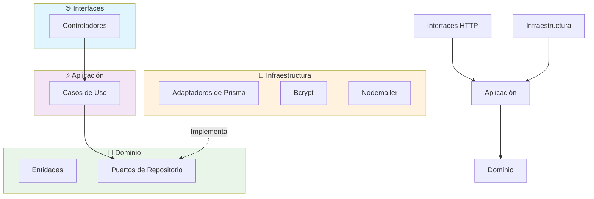
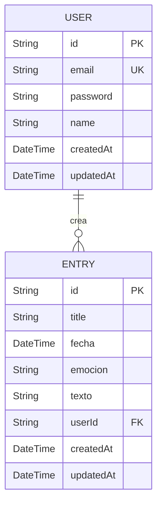
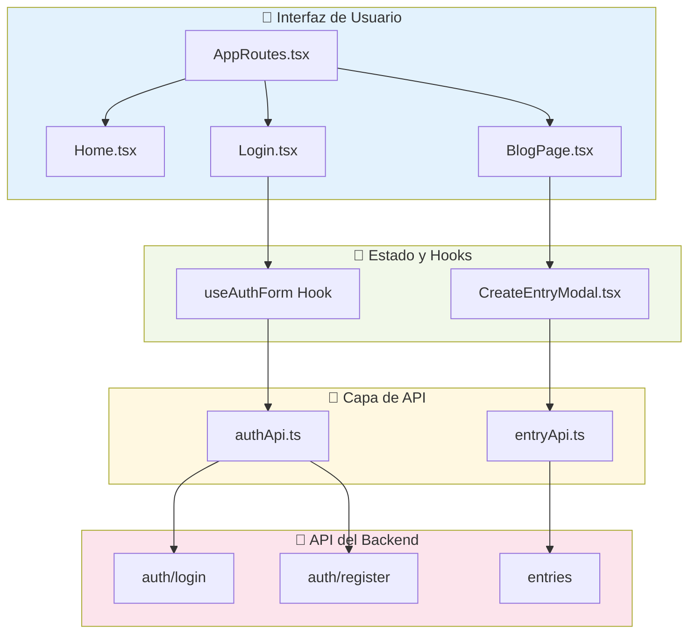

# EmotionalBlog - Diario Personal Full-Stack

EmotionalBlog es una aplicación web full-stack que permite a los usuarios crear, gestionar y reflexionar sobre entradas de diario personal, cada una asociada a una emoción específica. Está diseñada para ser un espacio privado y seguro para la expresión emocional y el autodescubrimiento.

Este repositorio contiene tanto el **Frontend (React)** como el **Backend (NestJS)**.

## Tabla de Contenidos

1. [Visión del Proyecto](#1-visión-del-proyecto)
2. [Stack Tecnológico](#2-stack-tecnológico)
3. [Diagramas de Arquitectura](#3-diagramas-de-arquitectura)
4. [Características](#4-características)
5. [Estructura del Proyecto](#5-estructura-del-proyecto)
6. [Prerrequisitos](#6-prerrequisitos)
7. [Puesta en Marcha](#7-puesta-en-marcha)
8. [Scripts Disponibles](#8-scripts-disponibles)
9. [Endpoints de la API](#9-endpoints-de-la-api)
10. [Contribuciones](#10-contribuciones)
11. [Licencia](#11-licencia)

---

## 1. Visión del Proyecto

El objetivo de EmotionalBlog es proporcionar una herramienta simple pero poderosa para el diario emocional. Los usuarios pueden documentar sus experiencias y sentimientos diarios, ayudándoles a identificar patrones, comprender su paisaje emocional y promover el bienestar mental.

## 2. Stack Tecnológico

| Componente | Tecnología / Librería |
| :-------------- | :--------------------------------------------------------------------------------- |
| **Backend** | **NestJS**, **TypeScript**, **Autenticación JWT**, **Zod** |
| **Base de Datos** | **PostgreSQL** gestionado con el ORM **Prisma** |
| **Frontend** | **React 19**, **Vite**, **TypeScript**, **React Router**, **Axios**, **CSS Modules** |
| **Tooling** | **PNPM** (backend), **Bun** (frontend), **ESLint**, **Prettier** |

---

## 3. Diagramas de Arquitectura

### Arquitectura del Backend (Hexagonal)

El backend está construido utilizando la **Arquitectura Hexagonal (Puertos y Adaptadores)** para asegurar una separación limpia de responsabilidades. El siguiente diagrama ilustra el flujo:



### Esquema de la Base de Datos (ERD)

La relación entre las entidades `User` y `Entry` en la base de datos:



### Arquitectura del Frontend (Basada en Funcionalidades)

La arquitectura del frontend está organizada **por funcionalidades** (*feature-based*). Esto significa que el código se agrupa por la característica a la que pertenece. Este enfoque mejora la cohesión y facilita la escalabilidad.



---

## 4. Características

- **Autenticación Segura de Usuarios**: Registro, inicio de sesión y recuperación de contraseña.
- **CRUD para Entradas de Diario**: Crear, leer, actualizar y eliminar entradas.
- **Asociación Emocional**: Cada entrada está vinculada a una emoción específica.
- **API RESTful**: Una API bien definida para la comunicación cliente-servidor.
- **UI Responsiva**: Diseño adaptable a escritorio y móviles.
- **Arquitectura Hexagonal**: Backend con separación clara de responsabilidades.
- **Validación de Datos**: Validación robusta con Zod en el backend.

---

## 5. Estructura del Proyecto

```
EmotionalBlog/
├── backend/                    # 🚀 API de NestJS (Servidor)
│   ├── src/
│   │   ├── auth/              # Módulo de autenticación
│   │   ├── entries/           # Módulo de entradas
│   │   ├── users/             # Módulo de usuarios
│   │   └── prisma/            # Configuración de Prisma
│   ├── prisma/
│   │   └── schema.prisma      # Esquema de base de datos
│   └── package.json
├── FrontEnd/                   # ⚛️ Aplicación de React (Cliente)
│   ├── src/
│   │   ├── components/        # Componentes reutilizables
│   │   ├── pages/             # Páginas de la aplicación
│   │   ├── hooks/             # Hooks personalizados
│   │   └── services/          # Servicios de API
│   └── package.json
└── README.md                   # Este archivo
```

---

## 6. Prerrequisitos

- [Node.js](https://nodejs.org/) (v18.x o superior)
- [PNPM](https://pnpm.io/installation) (para el backend)
- [Bun](https://bun.sh/docs/installation) (para el frontend)
- Una instancia de **PostgreSQL** en ejecución

---

## 7. Puesta en Marcha

Sigue estos pasos para tener la aplicación completa funcionando localmente.

### Configuración del Backend (con PNPM)

1. **Navega al directorio del backend:**
   ```bash
   cd backend
   ```

2. **Instala las dependencias:**
   ```bash
   pnpm install
   ```

3. **Configura el archivo `.env`** a partir del `.env.example`:
   ```bash
   cp .env.example .env
   # Edita .env con tus configuraciones
   ```

4. **Asegura y migra la base de datos:**
   ```bash
   pnpm exec prisma migrate dev
   ```

5. **Inicia el servidor:**
   ```bash
   pnpm run start:dev
   ```
   El servidor estará disponible en `http://localhost:3000`

### Configuración del Frontend (con Bun)

1. **Navega al directorio del frontend:**
   ```bash
   cd FrontEnd
   ```

2. **Instala las dependencias:**
   ```bash
   bun install
   ```

3. **Inicia el servidor de desarrollo:**
   ```bash
   bun run dev
   ```
   La aplicación estará disponible en `http://localhost:5173`

---

## 8. Scripts Disponibles

### Scripts del Backend (`/backend`) con PNPM

- `pnpm run start:dev`: Inicia el servidor en modo de desarrollo con observación
- `pnpm run build`: Compila el código para producción
- `pnpm run start:prod`: Inicia el servidor en modo producción
- `pnpm exec prisma studio`: Abre la GUI de Prisma Studio
- `pnpm exec prisma migrate dev`: Ejecuta migraciones en desarrollo
- `pnpm run test`: Ejecuta las pruebas unitarias

### Scripts del Frontend (`/FrontEnd`) con Bun

- `bun run dev`: Inicia el servidor de desarrollo de Vite
- `bun run build`: Empaqueta la aplicación de React para producción
- `bun run preview`: Previsualiza la build de producción
- `bun run lint`: Analiza el código con ESLint
- `bun run lint:fix`: Corrige automáticamente problemas de ESLint

---

## 9. Endpoints de la API

### Autenticación (`/auth`)

| Método | Ruta | ¿Auth? | Descripción |
|--------|------|--------|-------------|
| POST | `/auth/register` | ❌ | Registra un nuevo usuario |
| POST | `/auth/login` | ❌ | Inicia sesión y devuelve un token JWT |
| POST | `/auth/forgot-password` | ❌ | Envía un email para restablecer la contraseña |
| PUT | `/auth/reset-password` | ❌ | Restablece la contraseña usando un token |
| GET | `/auth/profile` | ✅ | Obtiene el perfil del usuario autenticado |

### Entradas del Diario (`/entries`)

| Método | Ruta | ¿Auth? | Descripción |
|--------|------|--------|-------------|
| POST | `/entries` | ✅ | Crea una nueva entrada de diario |
| GET | `/entries` | ✅ | Lista todas las entradas del usuario |
| GET | `/entries/:id` | ✅ | Obtiene una entrada específica |
| PATCH | `/entries/:id` | ✅ | Actualiza una entrada existente |
| DELETE | `/entries/:id` | ✅ | Elimina una entrada de diario |

**Ejemplo de payload para crear una entrada:**

```json
{
  "title": "Un día reflexivo",
  "texto": "Hoy fue un día lleno de introspección...",
  "emocion": "reflexivo",
  "fecha": "2024-01-15T10:30:00Z"
}
```

---

## 10. Guía de Contribución

¡Las contribuciones para mejorar **EmotionalBlog** son bienvenidas!
Aquí hay algunas maneras en las que puedes ayudar.

### Reporte de Bugs

Si encuentras un error, por favor, abre un *issue* en GitHub. Incluye la mayor cantidad de información posible:

1. **Pasos** para reproducir el error
2. **Comportamiento esperado** vs. comportamiento actual
3. **Capturas de pantalla** o logs si son relevantes
4. **Información del entorno** (OS, versión de Node, navegador, etc.)

### Sugerencia de Mejoras

Si tienes una idea para una nueva funcionalidad o una mejora, abre un *issue* para discutirla.
Explica claramente:

- El problema que intentas resolver
- Los beneficios de tu propuesta
- Casos de uso específicos

### Flujo de Pull Request

1. **Haz un fork** del repositorio
2. **Crea una nueva rama** para tu funcionalidad:
   ```bash
   git checkout -b feature/nombre-descriptivo
   ```
3. **Realiza tus cambios** siguiendo las convenciones del proyecto
4. **Asegúrate de que las pruebas pasen**:
   ```bash
   # Backend
   cd backend && pnpm test

   # Frontend
   cd FrontEnd && bun run lint
   ```
5. **Commit tus cambios** con mensajes descriptivos:
   ```bash
   git commit -m "feat: agregar funcionalidad de búsqueda de entradas"
   ```
6. **Push a tu rama** y abre un Pull Request

### Convenciones de Código

- **Backend**: Sigue las convenciones de NestJS y usa TypeScript estricto
- **Frontend**: Usa TypeScript, CSS Modules, y sigue las convenciones de React
- **Commits**: Usa [Conventional Commits](https://conventionalcommits.org/)
- **Formato**: El código debe pasar por ESLint y Prettier

---

## 11. Licencia

Distribuido bajo la **Licencia MIT**. Consulta el archivo `LICENSE` para más información.

---

## 🚀 Roadmap

### Próximas Funcionalidades

- [ ] **Dashboard de Analytics**: Visualización de patrones emocionales
- [ ] **Exportar Entradas**: Funcionalidad para exportar entradas a PDF/CSV
- [ ] **Temas Personalizables**: Modo oscuro y temas de colores
- [ ] **Recordatorios**: Notificaciones para escribir entradas diarias
- [ ] **Búsqueda Avanzada**: Filtros por emoción, fecha y contenido
- [ ] **Backup en la Nube**: Sincronización opcional con servicios en la nube

### Mejoras Técnicas

- [ ] **Testing**: Aumentar cobertura de pruebas
- [ ] **Docker**: Containerización para fácil deployment
- [ ] **CI/CD**: Pipeline de integración continua
- [ ] **Documentación API**: Swagger/OpenAPI integration
- [ ] **Performance**: Optimizaciones de carga y rendering

---

**¿Tienes preguntas o necesitas ayuda?** No dudes en abrir un issue o contactar a los mantenedores del proyecto.

**Hecho con ❤️ para el bienestar emocional y la reflexión personal.**
