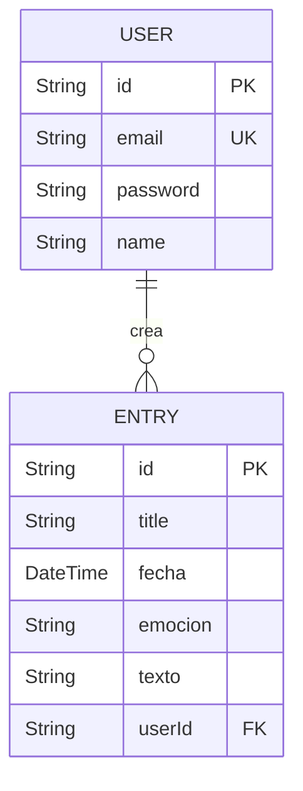

# EmotionalBlog - Diario Personal Full-Stack

EmotionalBlog es una aplicación web full-stack que permite a los usuarios crear, gestionar y reflexionar sobre entradas de diario personal, cada una asociada a una emoción específica. Está diseñada para ser un espacio privado y seguro para la expresión emocional y el autodescubrimiento.

Este repositorio contiene tanto el **Frontend (React)** como el **Backend (NestJS)**.

## Tabla de Contenidos

1.  [Visión del Proyecto](#1-visión-del-proyecto)
2.  [Stack Tecnológico](#2-stack-tecnológico)
3.  [Diagramas de Arquitectura](#3-diagramas-de-arquitectura)
4.  [Características](#4-características)
5.  [Estructura del Proyecto](#5-estructura-del-proyecto)
6.  [Prerrequisitos](#6-prerrequisitos)
7.  [Puesta en Marcha](#7-puesta-en-marcha)
8.  [Scripts Disponibles](#8-scripts-disponibles)
9.  [Endpoints de la API](#9-endpoints-de-la-api)
10. [Contribuciones](#10-contribuciones)
11. [Licencia](#11-licencia)

---

## 1. Visión del Proyecto

El objetivo de EmotionalBlog es proporcionar una herramienta simple pero poderosa para el diario emocional. Los usuarios pueden documentar sus experiencias y sentimientos diarios, ayudándoles a identificar patrones, comprender su paisaje emocional y promover el bienestar mental.

## 2. Stack Tecnológico

| Componente      | Tecnología / Librería                                                              |
| :-------------- | :--------------------------------------------------------------------------------- |
| **Backend**     | **NestJS**, **TypeScript**, **Autenticación JWT**, **Zod**                           |
| **Base de Datos** | **PostgreSQL** gestionado con el ORM **Prisma**                                    |
| **Frontend**    | **React 19**, **Vite**, **TypeScript**, **React Router**, **Axios**, **CSS Modules**      |
| **Tooling**     | **PNPM** (backend), **Bun** (frontend), **ESLint**, **Prettier**                     |

---

## 3. Diagramas de Arquitectura

### Arquitectura del Backend (Hexagonal)

El backend está construido utilizando la **Arquitectura Hexagonal (Puertos y Adaptadores)** para asegurar una separación limpia de responsabilidades. El siguiente diagrama ilustra el flujo:

```mermaid
graph TD
    A[Interfaces (HTTP)] --> B(Aplicación);
    C(Infraestructura) --> B;
    B --> D{Dominio};

    subgraph Interfaces
        direction LR
        A1(Controladores)
    end

    subgraph Aplicación
        direction LR
        B1(Casos de Uso)
    end

    subgraph Dominio
        direction LR
        D1(Entidades)
        D2(Puertos de Repositorio)
    end

    subgraph Infraestructura
        direction LR
        C1(Adaptadores de Prisma)
        C2(Bcrypt)
        C3(Nodemailer)
    end

    A1 --> B1;
    B1 --> D2;
    C1 -- Implementa Puerto --> D2;
```

### Esquema de la Base de Datos (ERD)

La relación entre las entidades `User` y `Entry` en la base de datos:



### Arquitectura del Frontend (Basada en Funcionalidades)

La arquitectura del frontend está organizada **por funcionalidades** (*feature-based*). Esto significa que el código se agrupa por la característica a la que pertenece. Este enfoque mejora la cohesión y facilita la escalabilidad.

```mermaid
graph TD
    subgraph Interfaz de Usuario (Componentes de React)
        A[AppRoutes.tsx] --> B[Home.tsx];
        A --> C[Login.tsx];
        A --> D[BlogPage.tsx];
    end

    subgraph Estado y Hooks
        C --> G["useAuthForm (Hook)"];
        D --> H["CreateEntryModal.tsx"];
    end

    subgraph Capa de API (Axios)
        J[authApi.ts]
        K[entryApi.ts]
    end

    subgraph API del Backend (localhost:3000)
        L[/auth/login]
        M[/auth/register]
        N[/entries]
    end

    G --> J;
    H --> K;

    J --> L;
    J --> M;
    K --> N;
```

---

## 4. Características

-   **Autenticación Segura de Usuarios**: Registro, inicio de sesión y recuperación de contraseña.
-   **CRUD para Entradas de Diario**: Crear, leer, actualizar y eliminar entradas.
-   **API RESTful**: Una API bien definida para la comunicación cliente-servidor.
-   **UI Responsiva**: Diseño adaptable a escritorio y móviles.

---

## 5. Estructura del Proyecto

```
/
├── backend/      # API de NestJS (Servidor)
├── FrontEnd/     # Aplicación de React (Cliente)
└── README.md     # Este archivo
```

---

## 6. Prerrequisitos

-   [Node.js](https://nodejs.org/) (v18.x o superior)
-   [PNPM](https://pnpm.io/installation) (para el backend)
-   [Bun](https://bun.sh/docs/installation) (para el frontend)
-   Una instancia de **PostgreSQL** en ejecución.

---

## 7. Puesta en Marcha

Sigue estos pasos para tener la aplicación completa funcionando localmente.

### Configuración del Backend (con PNPM)

1.  **Navega al directorio del backend:** `cd backend`
2.  **Instala las dependencias:** `pnpm install`
3.  **Configura el archivo `.env`** a partir del `.env.example`.
4.  **Asegura y migra la base de datos:** `pnpm exec prisma migrate dev`
5.  **Inicia el servidor:** `pnpm run start:dev` (disponible en `http://localhost:3000`)

### Configuración del Frontend (con Bun)

1.  **Navega al directorio del frontend:** `cd FrontEnd`
2.  **Instala las dependencias:** `bun install`
3.  **Inicia el servidor de desarrollo:** `bun run dev` (disponible en `http://localhost:5173`)

---

## 8. Scripts Disponibles

### Scripts del Backend (`/backend`) con PNPM

-   `pnpm run start:dev`: Inicia el servidor en modo de observación.
-   `pnpm run build`: Compila el código para producción.
-   `pnpm exec prisma studio`: Abre la GUI de Prisma Studio.

### Scripts del Frontend (`/FrontEnd`) con Bun

-   `bun run dev`: Inicia el servidor de desarrollo de Vite.
-   `bun run build`: Empaqueta la aplicación de React para producción.
-   `bun run lint`: Analiza el código con ESLint.

---

## 9. Endpoints de la API

### Autenticación (`/auth`)

| Método | Ruta                  | ¿Auth? | Descripción                                              |
|--------|-----------------------|--------|----------------------------------------------------------|
| POST   | /auth/register         | No     | Registra un nuevo usuario.                               |
| POST   | /auth/login            | No     | Inicia sesión y devuelve un token JWT.                   |
| POST   | /auth/forgot-password  | No     | Envía un email para restablecer la contraseña.           |
| PUT    | /auth/reset-password   | No     | Restablece la contraseña usando un token.                |

### Entradas del Diario (`/entries`)

| Método | Ruta           | ¿Auth? | Descripción                              |
|--------|----------------|--------|------------------------------------------|
| POST   | /entries       | Sí     | Crea una nueva entrada de diario.        |
| GET    | /entries       | Sí     | Lista todas las entradas del usuario.    |
| PATCH  | /entries/:id   | Sí     | Actualiza una entrada existente.         |
| DELETE | /entries/:id   | Sí     | Elimina una entrada de diario.           |

---

## 10. Guía de Contribución

¡Las contribuciones para mejorar **EmotionalBlog** son bienvenidas!
Aquí hay algunas maneras en las que puedes ayudar.

### Reporte de Bugs
Si encuentras un error, por favor, abre un *issue* en GitHub. Incluye la mayor cantidad de información posible:

1. **Pasos** para reproducir el error.
2. **Comportamiento esperado** vs. comportamiento actual.
3. **Capturas de pantalla** o logs si son relevantes.

### Sugerencia de Mejoras
Si tienes una idea para una nueva funcionalidad o una mejora, abre un *issue* para discutirla.
Explica claramente el problema que intentas resolver y los beneficios de tu propuesta.

### Flujo de Pull Request
1. Haz un **fork** del repositorio.
2. Crea una nueva rama para tu funcionalidad:
   ```bash
   git checkout -b feature/nombre-feature
   ```


---

## 11. Licencia

Distribuido bajo la Licencia MIT.
